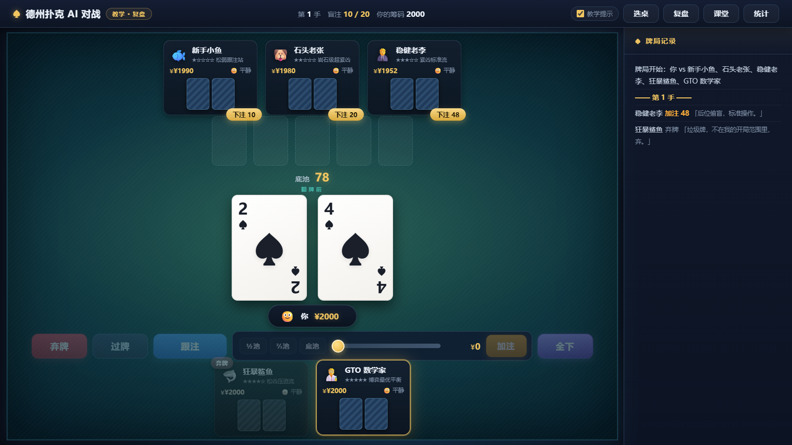
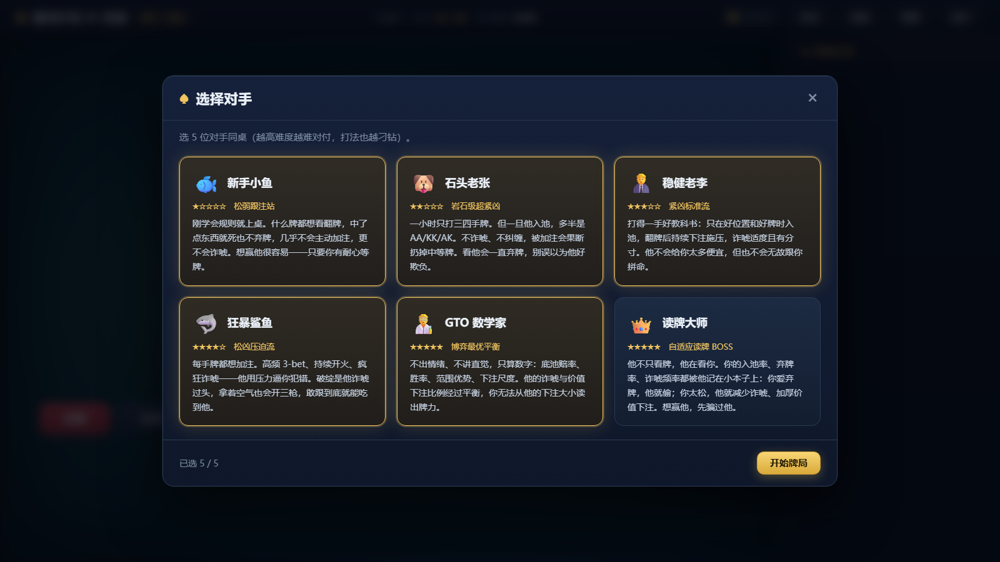
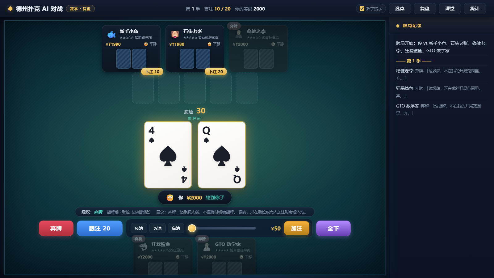

# 德州扑克 AI 对战 · 教学复盘版

    

人机对战的德州扑克（No-Limit Hold'em）游戏。**6 个性格迥异的 AI 对手**：难度不同、打法不同、会偷鸡、会上头、会记仇。

**在线体验**（纯前端，打开即玩）：https://woyaozhaoxifu.github.io/texas-holdem-ai-coach/

> **English TL;DR** — A zero-dependency Texas Hold'em trainer that runs entirely in the browser.
> Six AI opponents with distinct personalities (loose-passive calling station → GTO solver → a pro who profiles *your* habits).
> They bluff, go on tilt after bad beats, and hold grudges against you specifically.
> After every hand you get an auto-generated review: street-by-street replay, graded decisions with quantified EV cost,
> revealed opponent hole cards (was he bluffing?), and concept cards. No build step, no npm, no backend.

## 快速开始

**方式一（推荐）**：双击 `start.bat` —— 自动起本地服务器并在浏览器打开。

**方式二**：直接双击 `index.html`（零依赖纯前端，`file://` 也能跑）。

## 6 个 AI 对手

| 对手 | 难度 | 打法 | 怎么对付 |
|------|------|------|---------|
| 🐟 新手小鱼 | ★ | 松弱跟注站，什么牌都想看 | 别诈唬他，等好牌再价值下注 |
| 🐶 石头老张 | ★★ | 超紧，只玩前 20% 起手牌 | 他入池基本就是大牌，多偷他的盲 |
| 💼 稳健老李 | ★★★ | 教科书紧凶，位置意识强 | 别和他打太边缘的牌 |
| 🦈 狂暴鲨鱼 | ★★★★ | 松凶，高频 3-bet 疯狂诈唬 | 他有破绽：诈唬过度，敢跟就吃他 |
| 🔬 GTO 数学家 | ★★★★★ | 底池赔率 + 胜率最优，尺度极化 | 几乎没有破绽，少跟他硬碰 |
| 👑 读牌大师 | ★★★★★+ | 会**记录你的习惯**并针对调整 | 他会读你，你也要会反读 |

## 🏆 比赛模式（每轮 15 手 · 按轮结算）

选桌时点「🏆 比赛」即可进入锦标赛制：一轮 15 手、盲注逐轮升级、**不补筹（出局即淘汰）**、每轮按筹码结算名次积分（5/3/1）、只剩 1 人即产生冠军。详细规则见 **[更新总结（2026-09-07）](docs/SUMMARY_2026-09-07.md)**。

## 进阶机制（这是这个 AI 的灵魂）

- **偷鸡**：AI 在后位无人入池时会偷盲，不同人偷的频率差别巨大（鲨鱼几乎每手都偷、小鱼从不会）。
- **反偷**：被偷的人会用 3-bet 反击。鲨鱼和 GTO 是反偷高手。
- **情绪系统**：AI 会真的"上头"——赢大池会得意（打得更凶），被 bad beat 会心态炸裂（开始乱打）。每个座位旁有实时情绪表情。
- **对手关系**：你偷他的盲、他记着；你被他诈唬、你也记着。记仇的 AI 会**盯着你**（座位上有 ⚔️ 标记），对你更凶、更不愿弃牌；觉得你好欺负的会反复偷你（🎯 标记）。关系会随时间淡忘。
- **AI 思考气泡**：每个 AI 行动时都显示内心想法（"偷鸡得手""又是你——这把我不跑了"）。
- **真实感**：比赛 Ante / 牌面纹理 / ICM 生存压力 / 跨手学习（读牌大师会积累对手统计）/ 全下 EV 运气归因——见下方更新总结。
- **对手 HUD**：每个 AI 座位下有迷你统计徽标（入池 / 翻前加注），鼠标悬浮看完整历史。

## 教学系统（每手牌后自动弹出复盘）

1. **逐街回放**：翻前 → 翻牌 → 转牌 → 河牌，显示每一步的局面与各 AI 的行动。
2. **关键决策点评**：每个决策点打标 ✅最优 / ⚠️可接受 / ❌失误，给出**推荐打法**和**量化代价**（"这一手大约损失 27 筹码"）。
3. **对手解读**：摊牌时揭示 AI 底牌 + 它当时的想法 + 是否在诈唬——教你读人。
4. **知识点卡片**：按本手情况自动推荐相关扑克概念（底池赔率、半诈唬、慢打……）。
5. **实时教学提示**：轮到你在行动前，提示条会显示当前建议（可右上角关闭）。
6. **学习档案**：累计决策准确率、失误分布、常犯错误 Top3（存浏览器本地）。

## 界面一览

<table>
  <tr>
    <td width="50%"><b>选桌</b>：6 个对手任选 5 位同桌 </td>
    <td width="50%"><b>每手自动复盘</b>：逐街回放 + 决策点评 </td>
  </tr>
</table>

## 技术说明

- 零依赖、零构建：原生 HTML + CSS + JavaScript，无任何外部库。
- 文件结构：
  - `js/cards.js` 牌组　`js/handEval.js` 7选5手牌评估　`js/equity.js` 蒙特卡洛胜率
  - `js/ai/personalities.js` 6 人格参数　`js/ai/brain.js` 决策引擎（偷鸡/情绪/读牌）
  - `js/game.js` 牌局状态机（边池/全下/情绪/关系）　`js/coach.js` 教学　`js/review.js` 复盘
  - `js/ui.js` `js/main.js` 界面
- 规则完整：盲注、四街下注、**边池**、全下、平局分池、弃牌获胜。
- 全部 AI 引擎可在 Node 下独立跑自动化测试：`node tests/sim.js`。

📦 **打包运行**（桌面壳 / 手机同 WiFi 访问 / 小程序注意点）见 **[docs/PACKAGING.md](docs/PACKAGING.md)**。

## 自己造对手 / 参与开发

所有 AI 的性格都是 `js/ai/personalities.js` 里的一张纯数据表——改几个数字就能造出全新对手（偷盲频率、诈唬率、上头倾向、位置意识都能调）。

详见 **[CONTRIBUTING.md](CONTRIBUTING.md)**：本地运行、字段含义速查表、代码约定（零依赖零构建）、跑测试的方法。

## 许可

[MIT License](LICENSE) —— 随便用、随便改、随便拿去二次开发。
